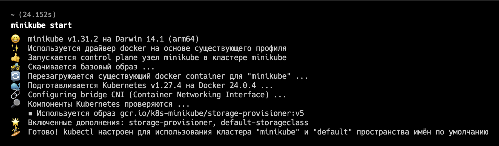
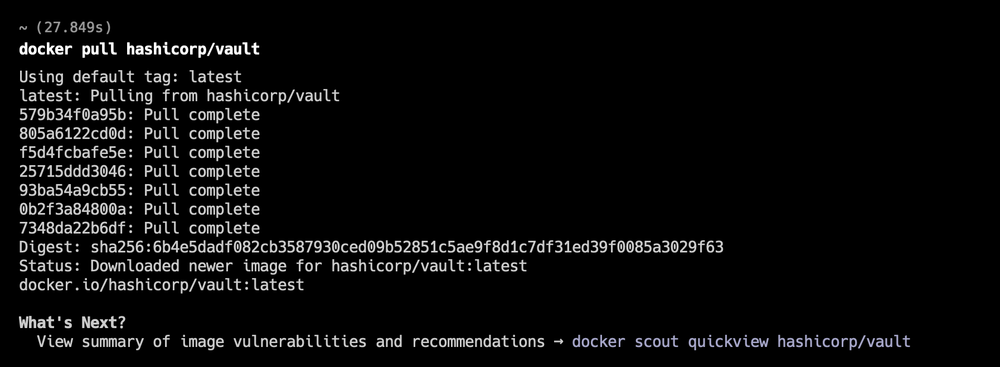
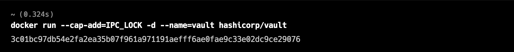
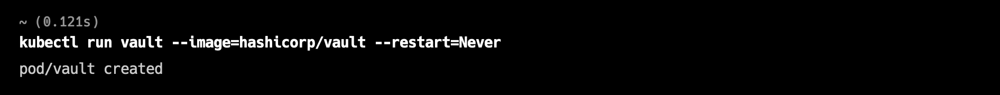
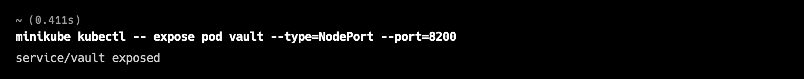
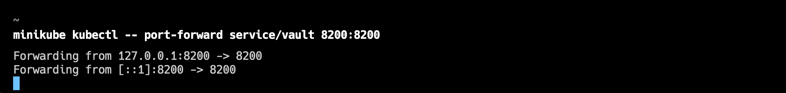
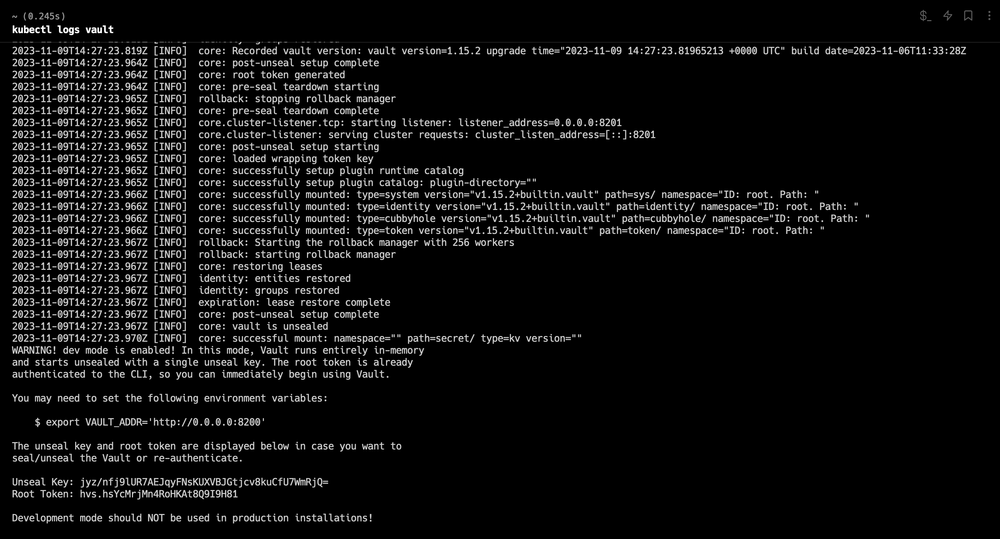
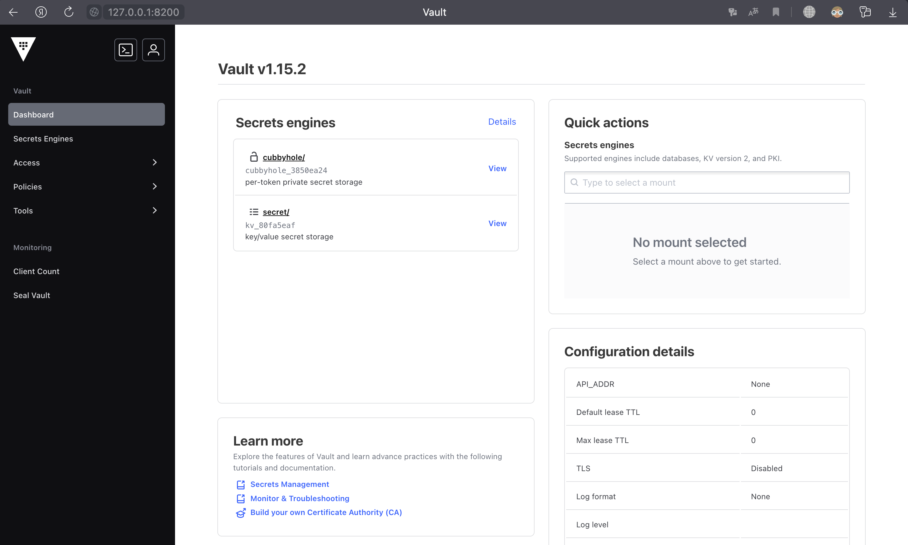
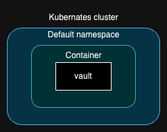

University: [ITMO University](https://itmo.ru/ru/)  
Faculty: [FICT](https://fict.itmo.ru)  
Course: [Introduction to distributed technologies](https://github.com/itmo-ict-faculty/introduction-to-distributed-technologies)  
Year: 2023/2024  
Group: K4113c  
Author: Shirshov Artem Sergeevich  
Lab: Lab1  
Date of create: 07.11.2023  
Date of finished: 09.11.2023  

# Лабораторная работа №1 "Установка Docker и Minikube, первый манифест."
### Описание
Это первая лабораторная работа в которой вы сможете протестировать Docker, установить Minikube и развернуть свой первый "под".

### Цель работы
Ознакомиться с инструментами Minikube и Docker, развернуть свой первый "под".

### Ход работы
В процессе выполнения работы были выполнены следующие шаги:
1. Установлен Docker, установлен и запущен Minikube;  

2. Скачан образ контейнера;  

3. Запущен контейнер из скачанного образа;  

4. Создан и запущен "под";  

5. Создана служба (Service) для "пода";  

6. Задано прямое соединение портов между локальным портом и портом службы;  

7. Для аутентификации использовался токен, найденный в логах;  

8. Полученный результат;  

9. Сгенерирован yaml файл для развертывания "пода";  

### Вывод
В результате выполнения работы были изучены инструменты Docker, Minikube, был развернут "под" и получен yaml файл для его развертывания.
