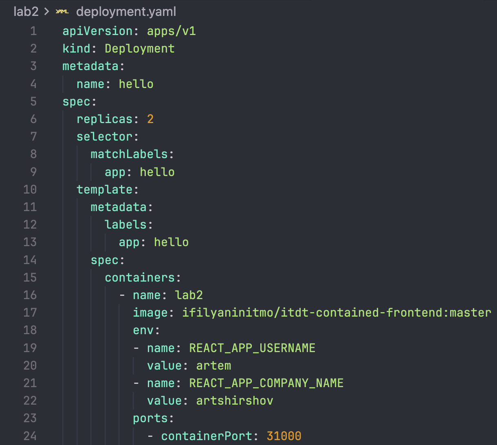

University: [ITMO University](https://itmo.ru/ru/)  
Faculty: [FICT](https://fict.itmo.ru)  
Course: [Introduction to distributed technologies](https://github.com/itmo-ict-faculty/introduction-to-distributed-technologies)  
Year: 2023/2024  
Group: K4113c  
Author: Shirshov Artem Sergeevich  
Lab: Lab2  
Date of create: 14.11.2023  
Date of finished: 16.11.2023  

# Лабораторная работа №2 "Развертывание веб сервиса в Minikube, доступ к веб интерфейсу сервиса. Мониторинг сервиса."
### Описание
В данной лабораторной работе вы познакомитесь с развертыванием полноценного веб сервиса с несколькими репликами.

### Цель работы
Ознакомиться с типами "контроллеров" развертывания контейнеров, ознакомится с сетевыми сервисами и развернуть свое веб приложение.

### Ход работы
В процессе выполнения работы были выполнены следующие шаги:
1. Создан Deployment с двумя репликами контейнера из указанного образа  

2. Создан Service для доступа к подам  

3. Запущен Deployment и Service  

4. Проверен статус подов  

5. Проброшены порты через minikube  

6. Запущено веб-приложение  

7. Проверены логи  

### Вывод
Таким образом, ознакомились с типами "контроллеров" развертывания контейнеров, ознакомились с сетевыми сервисами и развернули свое веб приложение.  
