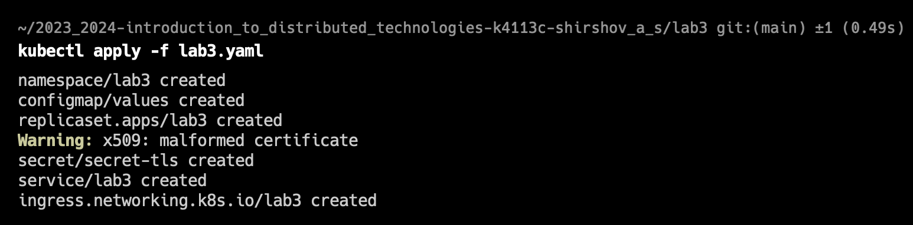

University: [ITMO University](https://itmo.ru/ru/)  
Faculty: [FICT](https://fict.itmo.ru)  
Course: [Introduction to distributed technologies](https://github.com/itmo-ict-faculty/introduction-to-distributed-technologies)  
Year: 2023/2024  
Group: K4113c  
Author: Shirshov Artem Sergeevich  
Lab: Lab3  
Date of create: 22.11.2023  
Date of finished: 23.11.2023  

# Лабораторная работа №3 "Сертификаты и "секреты" в Minikube, безопасное хранение данных."
### Описание
В данной лабораторной работе вы познакомитесь с сертификатами и "секретами" в Minikube, правилами безопасного хранения данных в Minikube.

### Цель работы
Познакомиться с сертификатами и "секретами" в Minikube, правилами безопасного хранения данных в Minikube.

### Ход работы
В процессе выполнения работы были выполнены следующие шаги:
1. Создан ConfigMap с требуемыми переменными  

2. Создан ReplicaSet, в который переданы указанные переменные  

3. Создан tls секрет, в который прописаны созданные приватный и публичные ключи  

4. Создан Service для приложения  

5. Создан Ingress. В него переданы ключи из секрета, а также указан путь, по которому будет доступно приложение  

6. Произведен деплой всего вышеуказанного  

7. Включен Ingress в Minikube  

8. Проложен сетевой туннель между локальным компьютером и кластером Kubernates  

9. Для пользователей MacOS/Windows необходимо указывать в hosts localhost, что и было сделано. Хотя в документации сказано, что в hosts надо указывать ip minikube. Как позже выяснилось, эта информация актуальна только для Linux  

10. Проверка работоспособности приложения в браузере. Все работает  

11. Сертификат  

### Вывод
Таким образом, ознакомились с сертификатами и "секретами" в Minikube, правилами безопасного хранения данных в Minikube  
