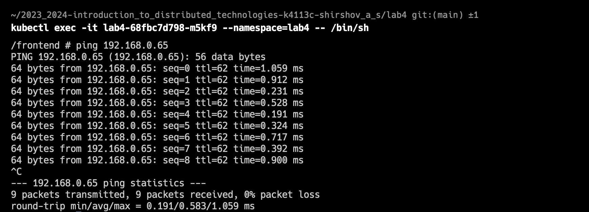

University: [ITMO University](https://itmo.ru/ru/)  
Faculty: [FICT](https://fict.itmo.ru)  
Course: [Introduction to distributed technologies](https://github.com/itmo-ict-faculty/introduction-to-distributed-technologies)  
Year: 2023/2024  
Group: K4113c  
Author: Shirshov Artem Sergeevich  
Lab: Lab4  
Date of create: 23.11.2023  
Date of finished: 23.11.2023  

# Лабораторная работа №4 "Сети связи в Minikube, CNI и CoreDNS"
### Описание
Это последняя лабораторная работа в которой вы познакомитесь с сетями связи в Minikube. Особенность Kubernetes заключается в том, что у него одновременно работают underlay и overlay сети, а управление может быть организованно различными CNI.

### Цель работы
Познакомиться с CNI Calico и функцией IPAM Plugin, изучить особенности работы CNI и CoreDNS.

### Ход работы
В процессе выполнения работы были выполнены следующие шаги:
1. Запущен minikube с подключенным плагином calico и двумя нодами  

2. Проверено наличие подов calico  

3. Проверено наличие двух разных нод  

4. Созданы лэйблы нодам  

5. Удален дефолтный ippool  

6. Созданы собственные ippool  

7. Проверено, что наши ippool созданы и с ними все верно  

8. Развернуто приложение с сервисом  

9. Проверены ip адреса. Адреса из тех ippool, которые мы создали, следовательно, все настроено верно  

10. Подключились к одному из подов и пинганули соседний. Пинг прошел, значит связь между ними есть  

11. Проброшены порты сервиса  

12. Открыто приложение в браузере. Все отобразилось корректно  

### Вывод
В результате выполнения лабораторной работы, ознакомились с CNI Calico и функцией IPAM Plugin, а также изучили особенности работы CNI и CoreDNS.  
